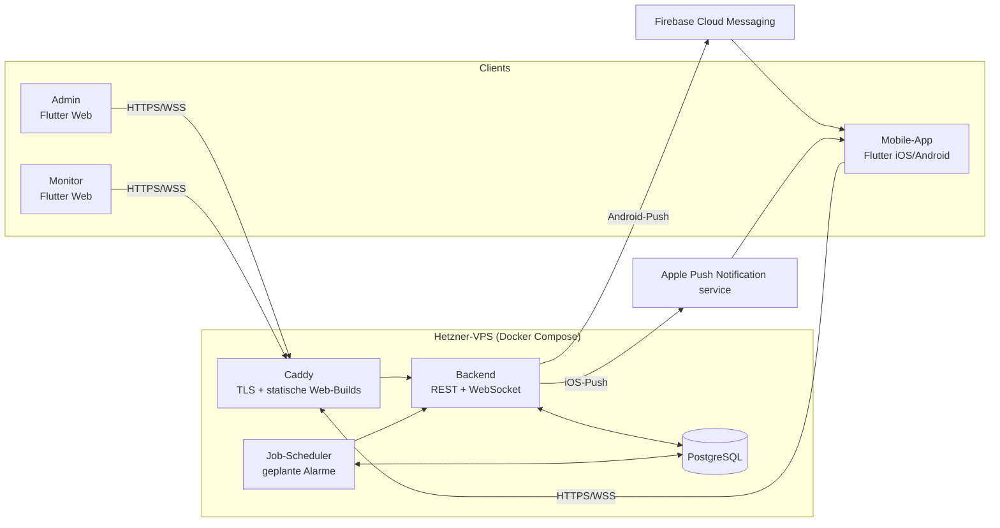

# 02 – Architektur

## Überblick



## Komponenten

### Backend (`backend/`)

Ein einzelner Prozess, der alles bedient. Bei der Größe einer JF reicht das locker.

- **REST-API** unter `/api/v1` für CRUD und Aktionen (alarmieren, Status setzen, quittieren).
- **WebSocket** unter `/ws` für Echtzeit-Events an Admin, Monitor und die geöffnete App.
- **Job-Scheduler** für zeitgesteuerte Alarme. Die Jobs liegen in PostgreSQL, damit sie einen
  Neustart überleben. Kein Redis nötig.
- **Push-Versand** an FCM (Android) und APNs (iOS).
- **OpenAPI-Spezifikation** wird aus dem Code erzeugt. Daraus wird `packages/api_client` generiert.

Sprache und Framework: siehe [ADR 0002](adr/0002-backend-sprache.md).

### Datenbank

PostgreSQL 17 im selben Docker-Compose-Stack. Die Migrationen verwaltet das Backend.

### Flutter-Apps

| App | Ziel | Auth |
|-----|------|------|
| `apps/web` – `/admin` | Browser am Laptop der Leitstelle | Benutzername + Passwort (Rolle admin/leitstelle) |
| `apps/web` – `/monitor` | Fernseher/Tablet im Kiosk-Modus | Gerätekopplung per Code |
| `apps/mobile` | Handys der Jugendlichen und Betreuer | Gerätekopplung per QR-Code |

Gemeinsamer Code liegt in `packages/core`: Repositories, State-Management, WebSocket-Client,
Reconnect-Logik, Domain-Enums (FMS-Status, Rollen).

### Reverse Proxy

**Caddy** übernimmt TLS (Let's Encrypt, automatisch), liefert die Flutter-Web-Builds als statische
Dateien aus und leitet `/api` und `/ws` an das Backend weiter.

## Echtzeit-Konzept

1. Jede Änderung (Statuswechsel, Alarmierung, Quittierung) wird zuerst in PostgreSQL geschrieben.
2. Danach sendet das Backend ein Event über den WebSocket an alle verbundenen Clients.
3. Clients halten **keinen** eigenen Wahrheitszustand. Nach einem (Re-)Connect holen sie
   `GET /api/v1/snapshot` und wenden danach nur noch Events an.
4. Jedes Event trägt eine fortlaufende `seq`. Bei einer Lücke lädt der Client den Snapshot neu.

So bleibt die Logik einfach. Da wir nur einen Backend-Prozess haben, brauchen wir weder
Pub/Sub noch einen Message-Broker.

## Alarmierungskette (Kurzfassung)

```
Leitstelle löst Alarmierung aus  ──oder──  Scheduler erreicht scheduled_at
            │
            ▼
Backend: alarm.state = triggered, Empfänger aus Besatzung einfrieren,
         Einsatz draft → running beim Erstalarm   (eine Transaktion)
            │
            ├── WebSocket-Event "alarm.triggered" → Monitor + offene Apps
            └── Push an alle Geräte der Empfänger → FCM / APNs
```

Details: [05 – Alarmierung und Push](05-alarmierung-push.md)

## Tech-Stack (Übersicht)

| Bereich | Wahl |
|---------|------|
| Mobile + Web | Flutter (stable), Dart 3 |
| State-Management | Riverpod |
| Routing | go_router |
| HTTP-Client | dio + generierter OpenAPI-Client |
| Backend | Node.js/TypeScript (Fastify) – Alternative Python (FastAPI), siehe ADR 0002 |
| Datenbank | PostgreSQL 17 |
| Push | FCM HTTP v1 (Android), APNs Token-Auth (iOS) |
| Reverse Proxy | Caddy 2 |
| Deployment | Docker Compose auf Hetzner-VPS |
| CI | GitHub Actions (Tests, Builds), optional fastlane für Store-Uploads |
