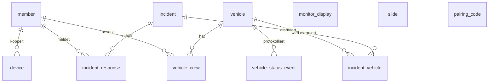
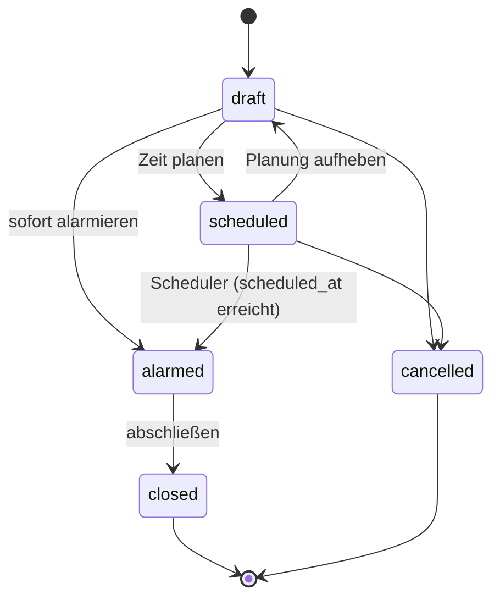

# 03 – Datenmodell

Entwurf für PostgreSQL. Alle IDs sind `uuid`, alle Zeitstempel `timestamptz` (UTC).
Für den MVP gibt es nur **eine** Organisation, deshalb braucht es keine `organization_id`.

## ER-Diagramm

## Tabellen

### `member`

| Spalte | Typ | Hinweis |
|--------|-----|---------|
| id | uuid PK | |
| display_name | text | z. B. „Max M.“ (Datensparsamkeit, siehe Datenschutz) |
| role | enum `admin`, `dispatcher`, `member` | admin = alles, dispatcher = Leitstelle, member = Jugendliche |
| username | text unique null | nur für admin/dispatcher (Web-Login) |
| password_hash | text null | Argon2id, nur für admin/dispatcher |
| active | bool | |
| created_at | timestamptz | |

### `device`

Ein Mitglied kann mehrere Geräte haben.

| Spalte | Typ | Hinweis |
|--------|-----|---------|
| id | uuid PK | |
| member_id | uuid FK → member | |
| platform | enum `android`, `ios` | |
| push_token | text null | FCM-Token bzw. APNs-Device-Token |
| refresh_token_hash | text | SHA-256 des Refresh-Tokens |
| app_version | text | |
| last_seen_at | timestamptz | |
| revoked_at | timestamptz null | Gerät abgemeldet/gesperrt |

### `pairing_code`

Einmalcodes zum Koppeln von Handys und Monitoren.

| Spalte | Typ | Hinweis |
|--------|-----|---------|
| code_hash | text PK | Code selbst wird nur einmal angezeigt (QR + 8-stellig) |
| target_type | enum `member`, `monitor` | |
| target_id | uuid | member.id oder monitor_display.id |
| expires_at | timestamptz | z. B. 24 h |
| used_at | timestamptz null | |

### `vehicle`

| Spalte | Typ | Hinweis |
|--------|-----|---------|
| id | uuid PK | |
| call_sign | text | Funkrufname, z. B. „Florian Musterstadt 1/46-1“ |
| short_name | text | z. B. „HLF 1“ |
| type | text | HLF, LF, TLF, DLK, RW, ELW, MTW, RTW … |
| status | smallint | aktueller FMS-Status (siehe unten) |
| status_changed_at | timestamptz | |
| sort_order | int | Reihenfolge auf dem Monitor |
| active | bool | |

### `vehicle_status_event`

Protokoll aller Statuswechsel (für Auswertung und Nachvollziehbarkeit).

| Spalte | Typ |
|--------|-----|
| id | uuid PK |
| vehicle_id | uuid FK |
| status | smallint |
| source | enum `app`, `admin`, `system` |
| member_id | uuid null |
| created_at | timestamptz |

### `vehicle_crew`

Feste Besatzung für den BF-Tag (welches Mitglied fährt auf welchem Fahrzeug).

| Spalte | Typ | Hinweis |
|--------|-----|---------|
| vehicle_id | uuid FK | |
| member_id | uuid FK | |
| position | text null | GF, MA, ATF, ATM, WTF, WTM … |
| PK | (vehicle_id, member_id) | |

### `incident`

| Spalte | Typ | Hinweis |
|--------|-----|---------|
| id | uuid PK | |
| number | int | fortlaufend, z. B. „Einsatz 7“ |
| keyword | text | Stichwort, z. B. „B2 – Wohnungsbrand“ |
| description | text | Meldebild / Zusatzinfos |
| address | text | |
| lat, lng | double null | für spätere Kartenanzeige |
| state | enum `draft`, `scheduled`, `alarmed`, `closed`, `cancelled` | |
| scheduled_at | timestamptz null | gesetzt bei zeitgesteuertem Alarm |
| alarmed_at | timestamptz null | |
| closed_at | timestamptz null | |
| created_by | uuid FK → member | |
| created_at | timestamptz | |

### `incident_vehicle`

| Spalte | Typ |
|--------|-----|
| incident_id | uuid FK |
| vehicle_id | uuid FK |
| PK | (incident_id, vehicle_id) |

Alarmiert werden alle Geräte der Mitglieder, die in `vehicle_crew` einem der Fahrzeuge
zugeordnet sind. Zusätzlich gibt es die Option „alle alarmieren“.

### `incident_response`

| Spalte | Typ | Hinweis |
|--------|-----|---------|
| incident_id | uuid FK | |
| member_id | uuid FK | |
| response | enum `coming`, `not_coming` | |
| responded_at | timestamptz | |
| PK | (incident_id, member_id) | letzte Rückmeldung gilt |

### `monitor_display`

| Spalte | Typ |
|--------|-----|
| id | uuid PK |
| name | text |
| refresh_token_hash | text |
| last_seen_at | timestamptz |
| revoked_at | timestamptz null |

### `slide`

Standby-Inhalte für den Monitor.

| Spalte | Typ | Hinweis |
|--------|-----|---------|
| id | uuid PK | |
| title | text | |
| body | text | Markdown |
| image_path | text null | Datei auf dem Server |
| duration_seconds | int | Anzeigedauer |
| sort_order | int | |
| active | bool | |

## FMS-Status

| Status | Bedeutung | in der App setzbar |
|--------|-----------|:------------------:|
| 1 | Einsatzbereit über Funk | ✓ |
| 2 | Einsatzbereit auf Wache | ✓ |
| 3 | Einsatz übernommen | ✓ |
| 4 | Am Einsatzort | ✓ |
| 5 | Sprechwunsch | ✓ |
| 6 | Nicht einsatzbereit | ✓ |
| 7 | Patient aufgenommen | ✓ (nur RTW/KTW) |
| 8 | Am Transportziel | ✓ (nur RTW/KTW) |

Optional später: Status 0 (priorisierter Sprechwunsch / Notruf) und Leitstellen-Rückmeldungen (J, C, …).

## Einsatz-Zustandsautomat

