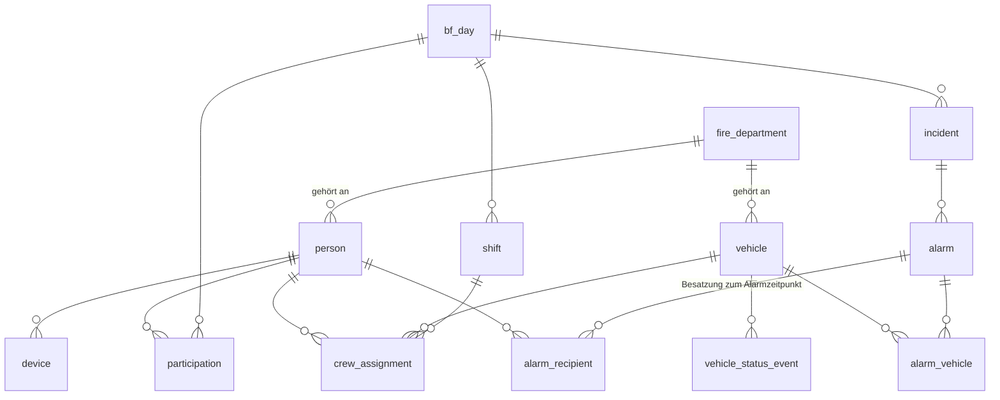
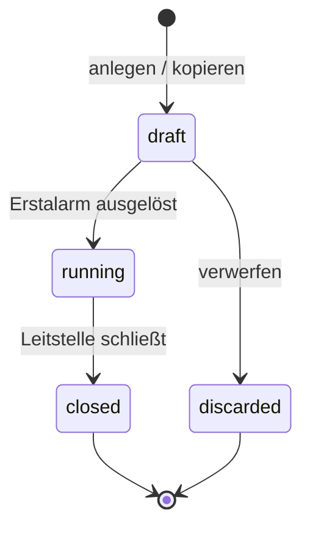
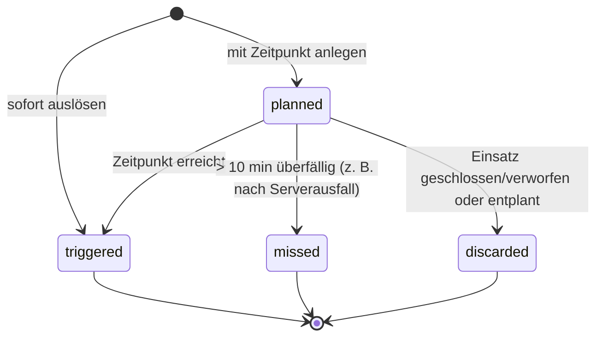

# 03 – Datenmodell

Entwurf für PostgreSQL. Alle IDs sind `uuid`, alle Zeitstempel `timestamptz` (UTC).
Fachbegriffe sind in [CONTEXT.md](../CONTEXT.md) definiert. Tabellen- und Spaltennamen sind
englisch, die Zuordnung zeigt die folgende Tabelle.

| Glossar | Tabelle | Phase |
|---------|---------|-------|
| BF-Tag | `bf_day` | MVP |
| Feuerwehr | `fire_department` | MVP (im UI nur die eigene) |
| Person, Personentyp, Berechtigung | `person` | MVP |
| Teilnahme | `participation` | MVP |
| Schicht | `shift` | MVP |
| Besatzung, Funktion | `crew_assignment` | MVP |
| Fahrzeugstatus | `vehicle.status`, `vehicle_status_event` | MVP |
| Einsatz, Meldebild, Drehbuch | `incident` | MVP |
| Alarmierung (Erstalarm, Nachalarmierung) | `alarm`, `alarm_vehicle` | MVP |
| Quittierung | `alarm_recipient.acknowledged_at` | MVP |
| Monitor, Folie | `monitor_display`, `slide` | MVP |
| Einsatzbericht | `incident_report` | später |
| Vorwarnung, Bereitmeldung | `incident.prewarning_minutes`, `incident.ready_at` | später |
| Sprechaufforderung | `vehicle_status_event` (Typ `talk_request`) | später |
| Durchsage | `announcement` | später |
| Tagesablauf, Programmpunkt | `program_item` | später |
| Anonymisierung | `bf_day.anonymized_at` + Job | MVP (manuell), automatisch später |

## ER-Diagramm (MVP)

## Stammdaten (dauerhaft)

### `fire_department` – Feuerwehr

| Spalte | Typ | Hinweis |
|--------|-----|---------|
| id | uuid PK | |
| name | text | |
| is_own | bool | genau eine Zeile `true` |

### `person` – Person

| Spalte | Typ | Hinweis |
|--------|-----|---------|
| id | uuid PK | |
| fire_department_id | uuid FK | |
| display_name | text | z. B. „Max M.“ (Datensparsamkeit) |
| person_type | enum `youth`, `supervisor` | Personentyp: Jugendlicher / Betreuer |
| permission | enum `crew`, `preparation`, `dispatch`, `admin` | Berechtigung: Mannschaft / Einsatzvorbereitung / Leitstelle / Administrator |
| username | text unique null | nur für Web-Login (Leitstelle, Administrator, Einsatzvorbereitung) |
| password_hash | text null | Argon2id |
| active | bool | |

Constraint: `permission = 'admin'` ⇒ `person_type = 'supervisor'`.

### `device` – gekoppeltes Handy

| Spalte | Typ | Hinweis |
|--------|-----|---------|
| id | uuid PK | |
| person_id | uuid FK | eine Person kann mehrere Geräte haben |
| platform | enum `android`, `ios` | |
| push_token | text null | |
| refresh_token_hash | text | |
| app_version | text | |
| last_seen_at | timestamptz | |
| revoked_at | timestamptz null | |

### `pairing_code`

| Spalte | Typ | Hinweis |
|--------|-----|---------|
| code_hash | text PK | |
| target_type | enum `person`, `monitor` | |
| target_id | uuid | |
| expires_at | timestamptz | |
| used_at | timestamptz null | |

### `vehicle` – Fahrzeug

| Spalte | Typ | Hinweis |
|--------|-----|---------|
| id | uuid PK | |
| fire_department_id | uuid FK | |
| call_sign | text | Funkrufname |
| short_name | text | z. B. „HLF 1“ |
| type | text | HLF, LF, TLF, DLK, RW, ELW, MTW, RTW … |
| status | smallint | aktueller Fahrzeugstatus (FMS 1–8) |
| status_changed_at | timestamptz | |
| sort_order | int | |
| active | bool | |

### `monitor_display`, `slide` – Monitor, Folie

Wie bisher: Monitor mit `name`, `refresh_token_hash`, `last_seen_at`, `revoked_at`;
Folie mit `title`, `body` (Markdown), `duration_seconds`, `sort_order`, `active`; das optionale
Bild liegt in `slide_image` (bytea in PostgreSQL, ADR 0014).

## Pro BF-Tag

### `bf_day` – BF-Tag

| Spalte | Typ | Hinweis |
|--------|-----|---------|
| id | uuid PK | |
| name | text | z. B. „BF-Tag 2027“ |
| starts_at, ends_at | timestamptz | |
| state | enum `planning`, `running`, `ended` | in Planung / läuft / beendet |
| anonymized_at | timestamptz null | gesetzt nach der Anonymisierung |

Höchstens ein BF-Tag ist gleichzeitig `running`.

### `participation` – Teilnahme

| Spalte | Typ |
|--------|-----|
| bf_day_id | uuid FK |
| person_id | uuid FK |
| PK | (bf_day_id, person_id) |

### `shift` – Schicht

| Spalte | Typ | Hinweis |
|--------|-----|---------|
| id | uuid PK | |
| bf_day_id | uuid FK | |
| name | text | z. B. „Schicht A“ |
| starts_at, ends_at | timestamptz | Standard: eine Schicht über den ganzen BF-Tag |

### `crew_assignment` – Besatzung

| Spalte | Typ | Hinweis |
|--------|-----|---------|
| shift_id | uuid FK | |
| vehicle_id | uuid FK | |
| person_id | uuid FK | Person muss am BF-Tag teilnehmen |
| function | text | Funktion: GF, MA, ATF, ATM, WTF, WTM, ME … |
| PK | (shift_id, vehicle_id, person_id) | eine Person darf in einer Schicht auf mehreren Fahrzeugen stehen |

### `vehicle_status_event` – Statushistorie

| Spalte | Typ | Hinweis |
|--------|-----|---------|
| id | uuid PK | |
| vehicle_id | uuid FK | |
| kind | enum `status`, `talk_request` | `talk_request` = Sprechaufforderung (später) |
| status | smallint null | |
| source | enum `app`, `dispatch`, `system` | |
| person_id | uuid null | wird bei der Anonymisierung entfernt |
| created_at | timestamptz | |

### `incident` – Einsatz

| Spalte | Typ | Hinweis |
|--------|-----|---------|
| id | uuid PK | |
| bf_day_id | uuid FK | |
| number | int | fortlaufend pro BF-Tag |
| keyword | text | Meldebild: Stichwort |
| address | text | Meldebild: Adresse |
| report | text | Meldebild: Lagebeschreibung |
| script | text | **Drehbuch**, nie an die Berechtigung Mannschaft ausliefern |
| state | enum `draft`, `running`, `closed`, `discarded` | Entwurf / laufend / abgeschlossen / verworfen |
| copied_from_id | uuid null | Einsatz aus früherem BF-Tag kopiert (später) |
| prewarning_minutes | int null | Vorwarnung (später) |
| ready_at | timestamptz null | Bereitmeldung (später) |
| closed_at | timestamptz null | |

### `alarm` – Alarmierung

| Spalte | Typ | Hinweis |
|--------|-----|---------|
| id | uuid PK | |
| incident_id | uuid FK | cascade |
| state | enum `alarm_state` (`planned`, `triggered`, `missed`, `discarded`) | geplant / ausgelöst / verpasst / verworfen |
| scheduled_at | timestamptz null | null = sofort |
| triggered_at | timestamptz null | |
| created_at | timestamptz not null | |

Die erste ausgelöste Alarmierung eines Einsatzes ist der **Erstalarm**, alle weiteren sind
**Nachalarmierungen**. Das wird über die Reihenfolge abgeleitet, nicht gespeichert.

### `alarm_vehicle`

| Spalte | Typ |
|--------|-----|
| alarm_id | uuid FK (cascade) |
| vehicle_id | uuid FK |
| PK | (alarm_id, vehicle_id) |

### `alarm_recipient` – Empfänger zum Alarmzeitpunkt und Quittierung

Wird beim Auslösen aus der Besatzung der aktiven Schicht **eingefroren**. Ein späterer
Schichtwechsel ändert die Empfänger nicht. Eine Person ist pro Alarmierung genau einmal
Empfänger (Doppelbesetzung auf mehreren alarmierten Fahrzeugen führt zu einer Zeile mit dem
ersten Fahrzeug nach `sort_order`, s. ADR 0017).

| Spalte | Typ | Hinweis |
|--------|-----|---------|
| alarm_id | uuid FK (cascade) | |
| person_id | uuid FK | |
| vehicle_id | uuid FK | erstes alarmiertes Fahrzeug nach `sort_order`, auf dem die Person sitzt |
| function | text not null | |
| has_device | bool not null | false = „kein Gerät“, zählt nicht als fehlende Quittierung |
| acknowledged_at | timestamptz null | Quittierung |
| PK | (alarm_id, person_id) | **nicht** `vehicle_id` – sonst wäre eine Person pro Alarmierung mehrfach Empfänger (ADR 0017) |

## Später

### `incident_report` – Einsatzbericht

| Spalte | Typ | Hinweis |
|--------|-----|---------|
| incident_id, vehicle_id | uuid FK | PK, ein Bericht pro Fahrzeug und Einsatz |
| author_person_id | uuid null | Person in Funktion GF; wird bei der Anonymisierung entfernt |
| situation | text | Lage bei Eintreffen |
| measures | text | durchgeführte Maßnahmen |
| notes | text | besondere Vorkommnisse |
| state | enum `draft`, `submitted`, `approved`, `returned` | |
| reviewed_by, reviewed_at | | Prüfung durch Leitstelle/Administrator |

Die Zeiten (Alarm, Status 3/4/1) werden aus `alarm` und `vehicle_status_event` berechnet.

### `announcement` – Durchsage

`bf_day_id`, `shift_id null` (null = an alle), `text`, `created_by`, `created_at`.

### `program_item` – Programmpunkt

`bf_day_id`, `title`, `type` (z. B. `meal`, `training`, `maintenance`, `rest`), `starts_at`, `ends_at`.

## Fahrzeugstatus (FMS)

| Status | Bedeutung | in der App setzbar |
|--------|-----------|:------------------:|
| 1 | Einsatzbereit über Funk | ✓ |
| 2 | Einsatzbereit auf Wache | ✓ |
| 3 | Einsatz übernommen (bestätigt das Ausrücken) | ✓ |
| 4 | Am Einsatzort | ✓ |
| 5 | Sprechwunsch | ✓ |
| 6 | Nicht einsatzbereit | ✓ |
| 7 | Patient aufgenommen | ✓ (nur RTW/KTW) |
| 8 | Am Transportziel | ✓ (nur RTW/KTW) |

Setzen dürfen den Status alle Personen der aktuellen Besatzung, die Leitstelle kann ihn überschreiben.

## Zustandsautomaten

### Einsatz

Sobald alle alarmierten Fahrzeuge Status 1/2 melden und keine Alarmierung mehr geplant ist,
**schlägt das System den Abschluss vor**. Beim Schließen werden noch geplante Alarmierungen
verworfen (mit Warnung).

### Alarmierung

## Anonymisierung

8 Wochen nach `bf_day.ends_at` (oder vorher manuell durch die Leitstelle):

| Daten | Aktion |
|-------|--------|
| Personen anderer Feuerwehren ohne weitere Teilnahme | löschen |
| `participation`, `crew_assignment`, `alarm_recipient` | löschen |
| `vehicle_status_event.person_id`, `incident_report.author_person_id` | auf null setzen |
| `incident` inkl. Meldebild und Drehbuch, `alarm`, Berichtstexte | behalten |

Siehe [ADR 0007](adr/0007-personen-dauerhaft-anonymisierung.md).
