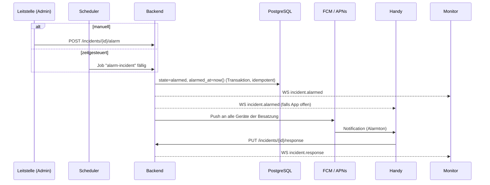

# 05 – Alarmierung und Push

## Ablauf



### Idempotenz

`alarm` darf nur von `draft`/`scheduled` nach `alarmed` wechseln
(`UPDATE … WHERE state IN ('draft','scheduled') RETURNING …`). Ein doppelter Klick oder ein
Scheduler-Retry löst so keinen zweiten Alarm aus.

### Zeitgesteuerte Alarme

- Bei `schedule` legt das Backend einen Job mit `start_after = scheduled_at` und einem
  Singleton-Key `incident:<id>` an.
- Bei `unschedule` und `cancel` wird der Job gelöscht.
- Nach einem Server-Neustart laufen überfällige Jobs sofort nach. Ein Alarm, der mehr als
  10 Minuten überfällig ist, wird **nicht** automatisch ausgelöst, sondern im Admin als
  „verpasst“ markiert.

## Push-Zustellung

Entscheidung: [ADR 0003](adr/0003-push.md)

| Plattform | Weg | Credentials |
|-----------|-----|-------------|
| Android | FCM HTTP v1 API | Service-Account-JSON eines Firebase-Projekts (nur Messaging) |
| iOS | APNs direkt (HTTP/2, Token-Auth) | `.p8`-Key, Key-ID, Team-ID, Bundle-ID |

Ohne FCM geht es auf Android praktisch nicht: Nur FCM kann eine App zuverlässig aus dem
Hintergrund bzw. Doze-Modus wecken. Firebase dient hier **ausschließlich** als Push-Transport,
es speichert keine Daten von uns.

### Payload (datensparsam)

Im Push stehen nur Stichwort, Adresse und die Einsatz-ID, keine Namen von Mitgliedern.

**Android (FCM, data + notification, Priorität `high`):**

```json
{
  "message": {
    "token": "<fcm-token>",
    "android": {
      "priority": "high",
      "ttl": "300s",
      "notification": {
        "channel_id": "alarm",
        "sound": "alarm",
        "tag": "incident-<id>"
      }
    },
    "notification": { "title": "B2 – Wohnungsbrand", "body": "Musterstraße 1" },
    "data": { "type": "incident.alarmed", "incident_id": "<id>" }
  }
}
```

**iOS (APNs):**

```json
{
  "aps": {
    "alert": { "title": "B2 – Wohnungsbrand", "body": "Musterstraße 1" },
    "sound": "alarm.caf",
    "interruption-level": "time-sensitive",
    "thread-id": "incident-<id>"
  },
  "incident_id": "<id>"
}
```

Header: `apns-push-type: alert`, `apns-priority: 10`, `apns-expiration: now+300`.

### Ungültige Tokens

- FCM antwortet mit `UNREGISTERED` bzw. `INVALID_ARGUMENT`, APNs mit `410 Unregistered` bzw.
  `BadDeviceToken`. Dann `device.push_token = null` setzen.
- Die App sendet bei jedem Start und bei `onTokenRefresh` ihr aktuelles Token per
  `PUT /me/device/push-token`.

## Alarmton und Plattform-Einschränkungen

### Android

- Eigener **Notification Channel** `alarm` mit Importance `HIGH`, eigenem Sound
  (`res/raw/alarm.ogg`) und Vibrationsmuster. Achtung: Sound und Importance eines Channels lassen
  sich nach dem Anlegen nicht mehr per Code ändern. Bei Änderungen eine neue Channel-ID wählen.
- **Nicht stören:** Ein Channel darf DND nur umgehen, wenn der Nutzer das erlaubt. Die App führt
  beim Onboarding in die Einstellungen (Benachrichtigungsrichtlinie / Channel-Einstellungen).
- **Full-Screen-Intent** (Alarm-Vollbild auf dem Sperrbildschirm): Ab Android 14 ist
  `USE_FULL_SCREEN_INTENT` für Play-Store-Apps auf Anruf- und Wecker-Apps beschränkt. Wir planen
  deshalb ohne ihn: Heads-up-Notification mit Alarmton. Die aktuelle Play-Richtlinie vor dem
  Release prüfen.
- **Akku-Optimierung:** Manche Hersteller (Xiaomi, Huawei, Samsung) beenden Hintergrund-Apps
  aggressiv. Im Onboarding auf das Abschalten der Akku-Optimierung hinweisen
  (Verweis auf dontkillmyapp.com).
- Android 13+: Laufzeit-Berechtigung `POST_NOTIFICATIONS` anfragen.

### iOS

- **Critical Alerts** (klingeln auch bei Stummschaltung) brauchen ein Sonder-Entitlement von
  Apple. Für eine Übungs-App wird das sehr wahrscheinlich nicht genehmigt, daher nicht eingeplant.
- **Time Sensitive Notifications** (Capability in Xcode aktivieren) durchbrechen Fokus-Modi,
  sofern der Nutzer das zulässt. Der Stummschalter wird aber respektiert.
- Eigener Sound als `.caf`/`.aiff` im App-Bundle, maximal 30 Sekunden.
- Hinweis an die Teilnehmer: Handy beim BF-Tag **nicht stumm** schalten.

## Fallback

- Ist die App im Vordergrund, kommt der Alarm über den WebSocket. Die App spielt dann selbst den
  Alarmton und zeigt das Alarm-Overlay.
- Der Monitor in der Halle ist die zweite, unabhängige Alarmierung (Ton über die Lautsprecher
  des Fernsehers).
- Im Admin ist pro Einsatz sichtbar, wie viele Pushes zugestellt bzw. abgelehnt wurden und wie
  viele Rückmeldungen eingegangen sind.
