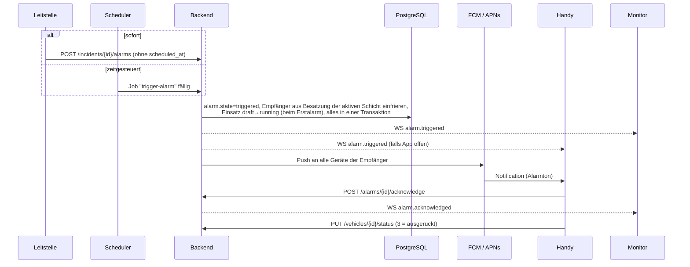

# 05 – Alarmierung und Push

Fachbegriffe: [CONTEXT.md](../CONTEXT.md) (Alarmierung, Erstalarm, Nachalarmierung, Quittierung, Besatzung).

## Ablauf einer Alarmierung



### Empfänger

- Empfänger sind alle Personen, die in der **zum Auslösezeitpunkt aktiven Schicht** einem der
  alarmierten Fahrzeuge zugeordnet sind. Sie werden in `alarm_recipient` eingefroren.
- Steht eine Person in derselben Schicht auf mehreren alarmierten Fahrzeugen, bekommt sie einen
  Push. Die Leitstelle erhält eine Warnung, dass die Person doppelt besetzt ist.
- Bei einer **Nachalarmierung** werden nur die neuen Fahrzeuge alarmiert. Personen, die schon
  im Einsatz sind, bekommen keinen zweiten Alarm.

### Idempotenz

Eine Alarmierung wechselt nur `planned → triggered` per
`UPDATE alarm SET state='triggered' … WHERE id=$1 AND state='planned' RETURNING …`. Eine sofortige
Alarmierung wird direkt als `triggered` angelegt. Doppelklick oder Scheduler-Retry lösen so keinen
zweiten Alarm aus. Der Einsatz wechselt `draft → running` mit derselben Bedingung.

### Zeitgesteuerte Alarmierungen

- Eine geplante Alarmierung legt einen Job mit `start_after = scheduled_at` und dem Singleton-Key
  `alarm:<id>` an. Wird der Zeitpunkt geändert, wird der Job ersetzt.
- Verwerfen (manuell oder durch Schließen bzw. Verwerfen des Einsatzes) löscht den Job.
- Nach einem Server-Neustart laufen überfällige Jobs sofort nach. Ist eine Alarmierung mehr als
  **10 Minuten** überfällig, wird sie **nicht** ausgelöst, sondern als `missed` (verpasst)
  markiert. Die Leitstelle entscheidet dann selbst.
- Später: Die **Vorwarnung** ist ein zweiter Job bei `scheduled_at − prewarning_minutes`. Er
  schickt einen normalen Push ohne Alarmton an die Einsatzvorbereitung.

### Quittierung

Die Leitstelle sieht pro Empfänger drei Zustände:

| Zustand | Bedeutung |
|---------|-----------|
| quittiert | Person hat den Alarm bestätigt |
| ausstehend | Gerät vorhanden, noch keine Quittierung, also prüfen, ob das Handy stumm ist |
| kein Gerät | Person hat kein gekoppeltes Gerät; wird über Monitor und Gong alarmiert, zählt nicht als fehlend |

Eine Zu- oder Absage gibt es nicht ([ADR 0006](adr/0006-quittierung-statt-rueckmeldung.md)).
Das Ausrücken bestätigt der Fahrzeugstatus 3.

## Push-Zustellung

Entscheidung: [ADR 0003](adr/0003-push.md)

| Plattform | Weg | Credentials |
|-----------|-----|-------------|
| Android | FCM HTTP v1 API | Service-Account-JSON eines Firebase-Projekts (nur Messaging) |
| iOS | APNs direkt (HTTP/2, Token-Auth) | `.p8`-Key, Key-ID, Team-ID, Bundle-ID |

Ohne FCM geht es auf Android praktisch nicht: Nur FCM kann eine App zuverlässig aus dem
Hintergrund bzw. Doze-Modus wecken. Firebase dient hier **ausschließlich** als Push-Transport,
es speichert keine Daten von uns.

### Payload (datensparsam)

Im Push stehen nur Stichwort und Adresse aus dem Meldebild sowie die IDs. Keine Namen von Personen, **nie das Drehbuch**.

**Android (FCM, data + notification, Priorität `high`):**

```json
{
  "message": {
    "token": "<fcm-token>",
    "android": {
      "priority": "high",
      "ttl": "300s",
      "notification": {
        "channel_id": "alarm",
        "sound": "alarm",
        "tag": "incident-<id>"
      }
    },
    "notification": { "title": "B2 – Wohnungsbrand", "body": "Musterstraße 1" },
    "data": { "type": "alarm.triggered", "incident_id": "<id>", "alarm_id": "<id>" }
  }
}
```

**iOS (APNs):**

```json
{
  "aps": {
    "alert": { "title": "B2 – Wohnungsbrand", "body": "Musterstraße 1" },
    "sound": "alarm.caf",
    "interruption-level": "time-sensitive",
    "thread-id": "incident-<id>"
  },
  "incident_id": "<id>",
  "alarm_id": "<id>"
}
```

Header: `apns-push-type: alert`, `apns-priority: 10`, `apns-expiration: now+300`.

### Ungültige Tokens

- FCM antwortet mit `UNREGISTERED` bzw. `INVALID_ARGUMENT`, APNs mit `410 Unregistered` bzw.
  `BadDeviceToken`. Dann `device.push_token = null` setzen.
- Die App sendet bei jedem Start und bei `onTokenRefresh` ihr aktuelles Token per
  `PUT /me/device/push-token`.

## Alarmton und Plattform-Einschränkungen

### Android

- Eigener **Notification Channel** `alarm` mit Importance `HIGH`, eigenem Sound
  (`res/raw/alarm.ogg`) und Vibrationsmuster. Achtung: Sound und Importance eines Channels lassen
  sich nach dem Anlegen nicht mehr per Code ändern. Bei Änderungen eine neue Channel-ID wählen.
- **Nicht stören:** Ein Channel darf DND nur umgehen, wenn der Nutzer das erlaubt. Die App führt
  beim Onboarding in die Einstellungen (Benachrichtigungsrichtlinie / Channel-Einstellungen).
- **Full-Screen-Intent** (Alarm-Vollbild auf dem Sperrbildschirm): Ab Android 14 ist
  `USE_FULL_SCREEN_INTENT` für Play-Store-Apps auf Anruf- und Wecker-Apps beschränkt. Wir planen
  deshalb ohne ihn: Heads-up-Notification mit Alarmton. Die aktuelle Play-Richtlinie vor dem
  Release prüfen.
- **Akku-Optimierung:** Manche Hersteller (Xiaomi, Huawei, Samsung) beenden Hintergrund-Apps
  aggressiv. Im Onboarding auf das Abschalten der Akku-Optimierung hinweisen
  (Verweis auf dontkillmyapp.com).
- Android 13+: Laufzeit-Berechtigung `POST_NOTIFICATIONS` anfragen.

### iOS

- **Critical Alerts** (klingeln auch bei Stummschaltung) brauchen ein Sonder-Entitlement von
  Apple. Für eine Übungs-App wird das sehr wahrscheinlich nicht genehmigt, daher nicht eingeplant.
- **Time Sensitive Notifications** (Capability in Xcode aktivieren) durchbrechen Fokus-Modi,
  sofern der Nutzer das zulässt. Der Stummschalter wird aber respektiert.
- Eigener Sound als `.caf`/`.aiff` im App-Bundle, maximal 30 Sekunden.
- Hinweis an die Teilnehmer: Handy beim BF-Tag **nicht stumm** schalten.

## Fallback

- Ist die App im Vordergrund, kommt der Alarm über den WebSocket. Die App spielt dann selbst den
  Alarmton und zeigt das Alarm-Overlay.
- Der Monitor in der Halle ist die zweite, unabhängige Alarmierung (Ton über die Lautsprecher
  des Fernsehers).
- Bei der Leitstelle ist pro Alarmierung sichtbar, wie viele Pushes zugestellt bzw. abgelehnt
  wurden und wer quittiert hat.
